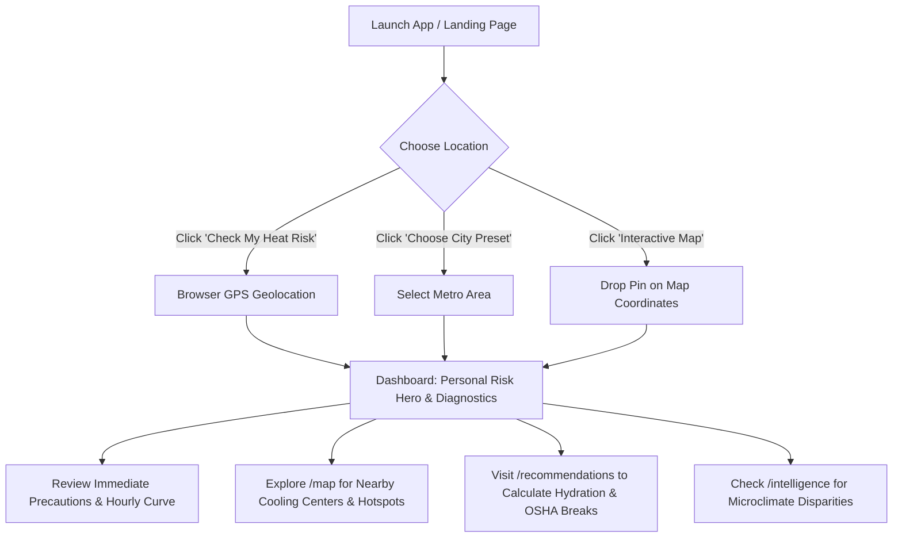

# HeatShield – Features & Application Workflow Guide

**HeatShield** is a real-time urban heat protection web application designed to help individuals, vulnerable populations, and municipal teams understand hyperlocal thermal risk and take immediate, life-saving precautions.

---

## 🌟 Table of Contents
1. [Core Features Breakdown](#1-core-features-breakdown)
   - [Global Controls & Top Navigation](#global-controls--top-navigation)
   - [Personal Risk Dashboard (`/`)](#personal-risk-dashboard-)
   - [Interactive Heat Map (`/map`)](#interactive-heat-map-map)
   - [Urban Thermal Intelligence (`/intelligence`)](#urban-thermal-intelligence-intelligence)
   - [Action Guidance & Protection Playbook (`/recommendations`)](#action-guidance--protection-playbook-recommendations)
2. [End-to-End User Workflow](#2-end-to-end-user-workflow)
   - [Step 1: Onboarding & Location Setup](#step-1-onboarding--location-setup)
   - [Step 2: Assessing Hyperlocal Risk](#step-2-assessing-hyperlocal-risk)
   - [Step 3: Exploring Neighborhood Microclimates](#step-3-exploring-neighborhood-microclimates)
   - [Step 4: Finding Emergency Cooling Stations](#step-4-finding-emergency-cooling-stations)
   - [Step 5: Planning Hydration & Safety Protocols](#step-5-planning-hydration--safety-protocols)
3. [Thermal Intelligence Architecture](#3-thermal-intelligence-architecture)

---

## 1. Core Features Breakdown

### Global Controls & Top Navigation
* **Live Location Indicator:** Displays the active city name or GPS coordinates. Clicking it opens the **Location Selector Modal** to quickly switch between major metropolitan heat zones (Phoenix, Houston, Los Angeles, Miami, Las Vegas, Chicago) or enter custom coordinates.
* **°F / °C Metric Switcher:** Instantly toggle between Fahrenheit and Celsius across the entire app (charts, metrics, dials, and map markers).
* **Navigation Links:** Instant access to all four core views (**Dashboard**, **Heat Map**, **Area Intelligence**, and **Action Guidance**).

---

### Personal Risk Dashboard (`/`)
The primary operational hub displaying a comprehensive 6-layer thermal breakdown:

1. **Visually Dominant Risk Hero Card:**
   - **Risk Severity Badge & Score:** Dynamic color-coded level (`Low`, `Moderate`, `High`, `Extreme`) paired with a calculated risk score (0–100).
   - **Large Temperature Readout:** Real-time ambient temperature alongside the perceived "Feels Like" heat index.
   - **Plain-Language Advisory:** Immediate, unambiguous hazard assessment (e.g., *"Extreme Heat Danger – Life-Threatening Exposure"*).
   - **Peak Heat Window & Trend:** Real-time peak risk timeframe (e.g., *1:30 PM – 5:15 PM*) and thermal trajectory (*Rising / Stable / Falling*).

2. **Microclimate Diagnostics (Sensor Grid):**
   - **Wet Bulb Globe Temperature (WBGT):** The gold standard for heat stress under direct sunlight (crucial for outdoor workers and athletes).
   - **Relative Humidity (%):** Live atmospheric moisture impact on body cooling.
   - **Solar Radiation Index ($W/m^2$):** Direct solar intensity measurement.
   - **Wind Speed & Air Quality (AQI):** Air circulation and combined pollution-heat hazards.

3. **Immediate Action Precautions:**
   - 3 to 4 actionable, high-priority safety measures updated dynamically based on the current risk tier.

4. **Smart Urban Insights Grid:**
   - **Neighborhood City Comparison:** Quantifies local heat disparity (e.g., *"Your area is hotter than 95% of metropolitan zones"*).
   - **Surface vs. Ambient Heat Delta:** Demonstrates how asphalt and concrete radiate extra thermal energy.
   - **Nighttime Thermal Retention Penalty:** Highlights overnight cooling deficits that cause heat exhaustion.

5. **Hourly Heat Trajectory Chart:**
   - Visual time-series graph tracking temperature progression and peak solar windows across 24 hours.

6. **Who is Most at Risk? (Demographic Matrix):**
   - Specific vulnerability breakdowns and safety guidelines for **Infants/Children**, **Elderly (65+)**, **Outdoor Workers**, and **Athletes & Pets**.

---

### Interactive Heat Map (`/map`)

* **Leaflet & Vector Heat Layer:** Visual thermal micro-zones showing the temperature gradient across urban asphalt cores and shaded parks.
* **Interactive Micro-Zone Selection:** Clicking any thermal circle or temperature pill slides open the **Zone Detail Sheet** with:
  - Localized neighborhood name and temperature.
  - Thermal disparity vs. city average ($+\Delta^\circ\text{F}$).
  - Surface composition metrics (Impervious asphalt % vs. Tree canopy %).
* **Municipal Cooling Center Markers:** Blue markers identifying air-conditioned libraries, community centers, and hydration stations with operational hours and transit accessibility.
* **Dynamic Location Pinning:** Clicking anywhere on the map moves the active user pin and recalculates the entire thermal risk profile for that exact spot.

---

### Urban Thermal Intelligence (`/intelligence`)

* **Microclimate Disparity Rankings:** A real-time leaderboard ranking neighborhoods from highest heat traps (*Asphalt Hotspots*) to lowest temperatures (*Green Cool Oases*).
* **Urban Heat Island (UHI) Explainer:** Educational guide illustrating the mechanics of thermal retention from dark building materials, vehicular heat, and reduced vegetative canopy.
* **Designated Cooling Center Directory:** Searchable and filterable directory of public shelters with distance, hours, and available amenities.

---

### Action Guidance & Protection Playbook (`/recommendations`)

* **Interactive Heat Safety Checklist:**
  - Categorized checklist with actionable steps for **Home & Indoor Cooling**, **Outdoor Work & Exercise**, and **Family & Pet Safety**.
  - Integrated OSHA and National Weather Service compliance guidelines.
* **Interactive Hydration & Electrolyte Calculator:**
  - **Custom Inputs:** Body weight, physical activity level (Resting, Moderate, Heavy labor), and sun exposure conditions.
  - **Dynamic Outputs:** Hourly recommended water intake (oz / mL), electrolyte replenishment intervals, and mandatory shaded rest breaks.
* **Heat Illness Medical Triage Guide:**
  - Clear symptom matrix differentiating **Heat Cramps**, **Heat Exhaustion**, and **Heat Stroke**.
  - Immediate first-aid protocols and critical emergency red flags (e.g., confusion, cessation of sweating, loss of consciousness).

---

## 2. End-to-End User Workflow

### Step 1: Onboarding & Location Setup
1. On initial visit, users are greeted by the **Welcome Screen**.
2. Click **"Check My Heat Risk"** to automatically geolocate your device, or select a major metro preset (e.g., *Phoenix, Houston, Los Angeles*).

### Step 2: Assessing Hyperlocal Risk
1. Review the large **Risk Hero Card** on the Dashboard for immediate danger status.
2. Check the **Microclimate Diagnostics** for WBGT and Solar Radiation to assess outdoor safety.
3. Review the **Hourly Forecast Chart** to identify safe time windows for going outside.

### Step 3: Exploring Neighborhood Microclimates
1. Navigate to **Heat Map** via the top navigation bar.
2. Click on colored thermal zones (Red = Extreme Hotspot, Green = Cool Oasis) to inspect neighborhood canopy coverage and asphalt density.
3. Click any unselected area on the map to recalculate heat risk for that specific neighborhood.

### Step 4: Finding Emergency Cooling Stations
1. In the Heat Map or Area Intelligence view, locate designated **Cooling Center pins**.
2. Review opening hours, address, and amenities to find the nearest air-conditioned refuge during extreme heat waves.

### Step 5: Planning Hydration & Safety Protocols
1. Navigate to **Action Guidance** (`/recommendations`).
2. Input your body weight and expected outdoor work intensity into the **Hydration Calculator**.
3. Follow the calculated water intake rate and mandatory shade rest schedule.
4. Review the **Heat Illness Triage Guide** to recognize early symptoms of heat exhaustion.

---

## 3. Thermal Intelligence Architecture

* **Live FortyGuard API Client (`src/lib/fortyguard.ts`):**  
  Integrates with FortyGuard's `POST /v1/env_params` endpoint for real-time thermal indices, surface temperature models, and environmental parameters.
* **Thermal Fallback Simulation Engine (`src/lib/mockHeatData.ts` & `src/lib/heatCalculations.ts`):**  
  Ensures 100% offline and development reliability by running localized thermodynamic calculations (WBGT, Steadman Heat Index, and diurnal solar curves) if network connectivity or API credits are interrupted.
* **Leaflet Map Rendering (`src/components/map/HeatMap.tsx`):**  
  High-performance vector rendering for responsive thermal heat layers and interactive shelter locations.
